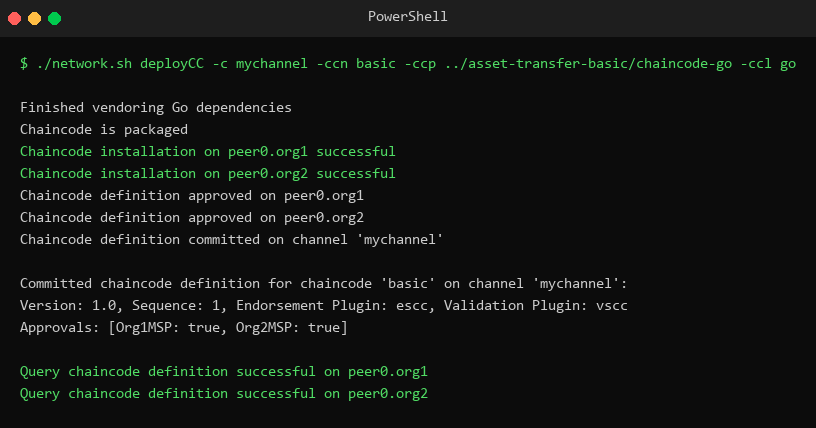
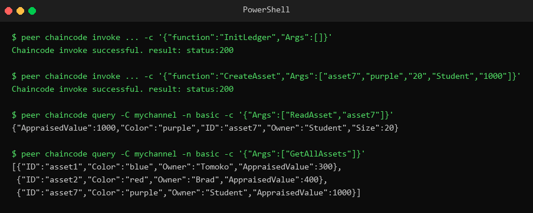
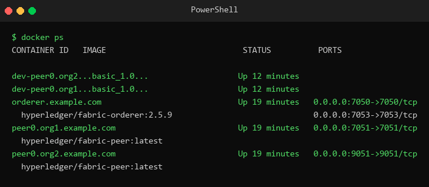

# Лабораторная работа 4. Hyperledger Fabric

## Цель работы

Установить Hyperledger Fabric, запустить тестовую сеть, создать канал, развернуть chaincode и выполнить операции с активами.

## Используемые инструменты

- Hyperledger Fabric v2.5.9
- Docker Desktop (WSL2 backend)
- Go 1.23.8
- WSL2 (Arch Linux)

## Выполненные шаги

### 1. Установка Hyperledger Fabric

Скачаны бинарники Fabric v2.5.9 и Fabric CA v1.5.12 для Linux amd64. Стянуты Docker-образы:

```
hyperledger/fabric-peer:2.5.9
hyperledger/fabric-orderer:2.5.9
hyperledger/fabric-tools:2.5.9
hyperledger/fabric-ca:1.5.12
hyperledger/fabric-ccenv:latest
hyperledger/fabric-baseos:latest
```

### 2. Запуск тестовой сети

```bash
./network.sh up
```

Запущены три контейнера: orderer и два пира (Org1, Org2).

### 3. Создание канала

```bash
./network.sh createChannel -c mychannel
```

Канал `mychannel` создан, оба пира подключены, анкорные пиры настроены для Org1MSP и Org2MSP.

### 4. Развёртывание chaincode

```bash
./network.sh deployCC -c mychannel -ccn basic \
  -ccp ../asset-transfer-basic/chaincode-go -ccl go
```



Chaincode `basic` v1.0 установлен на обоих пирах, одобрен Org1MSP и Org2MSP, зафиксирован на канале.

### 5. Создание тестового актива

Инициализация реестра (`InitLedger`), создание актива `asset7` и проверка запросом:



```json
{"AppraisedValue":1000,"Color":"purple","ID":"asset7","Owner":"Student","Size":20}
```

### 6. Результат docker ps



Всего 5 контейнеров: orderer, 2 пира и 2 chaincode-контейнера (по одному на каждый пир).
